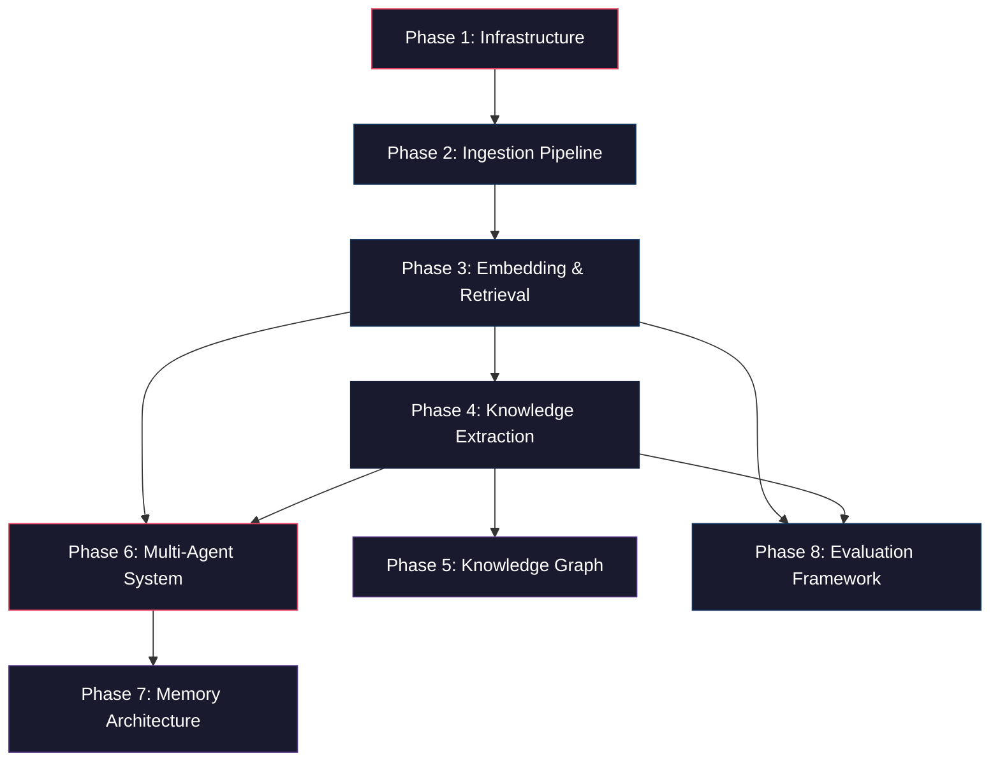

# 🚀 Autonomous Multi-Agent Research System — Implementation Plan

---

## Overview

This plan breaks the project into **8 phases** following the blueprint in `Instructions.md`. We follow a **foundation-first** strategy: ingestion → retrieval → extraction → agents → UI. Each phase has clear deliverables, estimated effort, and dependencies.

### ⚡ Updated Approach (v2)

| Original | Updated |
|---|---|
| FastAPI backend | **Pure Python Flask** backend |
| Next.js + Tailwind frontend | **HTML + CSS + JS + Tailwind CSS** (CDN) |
| Docker Compose for all services | **No Docker** — everything runs locally |
| PostgreSQL via container | **SQLite** for dev (migrate to PostgreSQL later) |
| Redis via container | **In-memory** / file-based queues for dev |
| Qdrant via container | **Qdrant local** (pip install) or **ChromaDB** |

> **Note:** This simplified stack lets us start building immediately without Docker overhead. Every component can be upgraded to production-grade infrastructure later without changing business logic.

---

## 🔑 What I Need From You (APIs & Decisions)

### API Keys Required

| Service | Purpose | When Needed | Free Tier? |
|---|---|---|---|
| **Groq API Key** | LLM calls via Groq (fast inference) | Phase 4 onwards | ✅ Free tier available |
| **HuggingFace Token** | Download `bge-m3` embeddings & `bge-reranker-large` | Phase 3 | ✅ Free |

### Decisions Needed From You

| # | Question | Impact |
|---|---|---|
| 1 | **Which Groq model?** — Llama 3, Mixtral, or Gemma? | Phase 4+ |
| 2 | **Neo4j** — Include knowledge graph (Phase 5) or skip for MVP? | Phase 5 |
| 3 | **Target: MVP-first or full build?** | Overall timeline |

---

## 📊 Phase Dependency Graph



> **Important:** Phases 1 → 2 → 3 → 4 are strictly sequential. Phase 5 (Knowledge Graph) and Phase 8 (Evaluation) can be parallelized after Phase 4. Phase 6 (Agents) needs Phases 3 + 4 complete.

---

## 🏗️ Phase 1 — Infrastructure Foundation

**Goal:** Set up the Flask backend, SQLite database, project structure, authentication, and a basic frontend shell.

**Estimated Time:** 2–3 days

### Deliverables

| Component | Details |
|---|---|
| **Flask Server** | App factory pattern, blueprints, CORS, error handling, health check |
| **Configuration** | `.env` file, Python config classes, environment validation |
| **Authentication** | JWT-based auth (register, login, token refresh) via `flask-jwt-extended` |
| **Database** | SQLite + SQLAlchemy ORM + Flask-Migrate (Alembic) |
| **Logging** | Structured JSON logging with Python `logging` + custom formatters |
| **Frontend Shell** | HTML/CSS/JS base layout with Tailwind CSS (CDN), login/register pages |
| **Project Structure** | Full folder structure as specified below |

### Tech Stack for This Phase
- Python 3.11+, Flask, Gunicorn
- SQLite (dev) → PostgreSQL (prod)
- SQLAlchemy 2.0 + Flask-Migrate
- flask-jwt-extended (JWT auth)
- Tailwind CSS via CDN
- Vanilla JavaScript (no framework)

### Project Structure
```
research-agent/
├── backend/
│   ├── app/
│   │   ├── __init__.py          # Flask app factory
│   │   ├── config.py            # Configuration classes
│   │   ├── extensions.py        # SQLAlchemy, JWT, Migrate init
│   │   ├── models/
│   │   │   ├── __init__.py
│   │   │   └── user.py          # User model
│   │   ├── api/
│   │   │   ├── __init__.py
│   │   │   ├── auth.py          # Auth blueprint (register/login)
│   │   │   ├── papers.py        # Papers blueprint (placeholder)
│   │   │   └── query.py         # Query blueprint (placeholder)
│   │   ├── services/
│   │   │   ├── __init__.py
│   │   │   └── auth_service.py  # Auth business logic
│   │   ├── middleware/
│   │   │   ├── __init__.py
│   │   │   └── logging_middleware.py
│   │   └── utils/
│   │       ├── __init__.py
│   │       └── responses.py     # Standardized API responses
│   ├── migrations/              # Flask-Migrate (Alembic)
│   ├── tests/
│   │   └── test_auth.py
│   ├── requirements.txt
│   ├── run.py                   # Entry point
│   └── .env.example
│
├── frontend/
│   ├── static/
│   │   ├── css/
│   │   │   └── styles.css       # Custom styles
│   │   ├── js/
│   │   │   ├── app.js           # Main app logic
│   │   │   ├── auth.js          # Auth module
│   │   │   └── api.js           # API client
│   │   └── assets/              # Images, icons
│   ├── templates/
│   │   ├── base.html            # Base layout with Tailwind
│   │   ├── index.html           # Landing/dashboard
│   │   ├── login.html           # Login page
│   │   └── register.html        # Register page
│
├── .env.example
├── .gitignore
├── README.md
├── Instructions.md
└── implementation_plan.md
```

### ✅ Exit Criteria
- [ ] `python run.py` starts the Flask server
- [ ] `/api/health` endpoint returns `200 OK`
- [ ] JWT auth flow works (register → login → access protected route)
- [ ] SQLite database created with User table
- [ ] Flask-Migrate migrations work
- [ ] Structured logs visible in console
- [ ] Frontend loads with Tailwind styling
- [ ] Login/Register pages connect to backend API

---

## 📄 Phase 2 — Research Ingestion Pipeline

**Goal:** Reliable PDF upload, parsing, and intelligent chunking.

**Estimated Time:** 3–4 days

### Deliverables

| Component | Details |
|---|---|
| **PDF Upload API** | `POST /api/papers/upload` — accepts PDF, stores file, returns `paper_id` |
| **PDF Parser** | PyMuPDF-based extraction of text, pages, structure |
| **Metadata Extractor** | Title, abstract, authors, sections, references |
| **Chunking Engine** | Section-aware + semantic chunking with overlap |
| **Storage** | PDFs stored locally in `uploads/`, metadata in SQLite |
| **Background Processing** | Python `threading` or `concurrent.futures` for non-blocking uploads |

### Chunking Strategy
```
PDF → Parse Pages → Detect Sections → Semantic Chunk per Section
                                         │
                                         ▼
                                  Chunk Metadata:
                                  {paper_id, section, chunk_id,
                                   text, page, embedding_model}
```

- **Section-aware:** Chunks never span section boundaries
- **Semantic:** Use sentence boundaries, not fixed character counts
- **Overlap:** 10-15% overlap between consecutive chunks
- **Target size:** 512–768 tokens per chunk

### Database Models
- `Paper` — id, title, authors, abstract, upload_date, file_path, status
- `PaperSection` — id, paper_id, section_name, content, order
- `Chunk` — id, paper_id, section_id, text, page, chunk_index, token_count

### ✅ Exit Criteria
- [ ] Upload a PDF → get structured sections back
- [ ] Chunks have correct metadata (paper_id, section, page)
- [ ] No chunk exceeds token limit
- [ ] Background processing works (upload returns immediately)
- [ ] At least 3 test papers ingested successfully
- [ ] Frontend has a working upload interface

---

## 🔍 Phase 3 — Embedding & Retrieval System

**Goal:** High-quality hybrid retrieval with BM25 + dense + reranking.

**Estimated Time:** 4–5 days

### Deliverables

| Component | Details |
|---|---|
| **Embedding Pipeline** | Generate `bge-m3` embeddings locally (RTX 3050 GPU) |
| **Vector Store** | ChromaDB or Qdrant (pip install) for vector storage |
| **BM25 Index** | `rank-bm25` based sparse retrieval |
| **Hybrid Search** | Merge BM25 + dense results with configurable weights |
| **Reranker** | `bge-reranker-large` cross-encoder reranking (local GPU) |
| **Query API** | `POST /api/query` — accepts question, returns ranked chunks with scores |

### Retrieval Pipeline
```
User Query
    │
    ├──► BM25 Search (top 20)
    │
    ├──► Dense Retrieval via ChromaDB/Qdrant (top 20)
    │
    ▼
Reciprocal Rank Fusion (merge)
    │
    ▼
Cross-Encoder Reranking (bge-reranker-large)
    │
    ▼
Top-K Final Chunks (with scores + citations)
```

### Key Design Decisions
- **Embedding model:** `BAAI/bge-m3` (1024-dim, multilingual) — local GPU
- **Reranker:** `BAAI/bge-reranker-large` — local GPU
- **Fusion method:** Reciprocal Rank Fusion (RRF)
- **Top-K default:** 5 (configurable)

### ✅ Exit Criteria
- [ ] Embed all chunks from ingested papers
- [ ] BM25 search returns relevant results
- [ ] Dense search returns relevant results
- [ ] Hybrid search outperforms individual methods
- [ ] Reranker improves result quality
- [ ] Query API returns chunks with paper_id, section, score, text
- [ ] Frontend has a search interface

---

## 🧠 Phase 4 — Structured Knowledge Extraction

**Goal:** LLM-powered extraction of structured research knowledge from papers.

**Estimated Time:** 3–4 days

> **Warning:** This phase requires a **Groq API Key** for LLM inference.

### Deliverables

| Component | Details |
|---|---|
| **LLM Abstraction Layer** | Unified interface for Groq / future providers |
| **Extraction Prompts** | Structured prompts for each field (validated outputs) |
| **Extraction Pipeline** | Paper → LLM → Structured JSON → Validated → Stored |
| **Validation Layer** | Schema validation, completeness checks, confidence scores |
| **Storage** | Extracted data in SQLite with proper relational schema |

### Extracted Fields (per paper)
```json
{
  "title": "",
  "authors": [],
  "datasets": [],
  "architectures": [],
  "metrics": {},
  "limitations": [],
  "future_work": [],
  "training_details": {},
  "paper_summary": ""
}
```

### LLM Provider Abstraction
```python
class LLMProvider(ABC):
    def generate(self, prompt, schema) -> dict: ...

class GroqProvider(LLMProvider): ...
class OpenAIProvider(LLMProvider): ...  # future
class LocalProvider(LLMProvider): ...   # future: Ollama
```

### ✅ Exit Criteria
- [ ] Extract structured data from at least 5 papers
- [ ] All outputs pass validation
- [ ] LLM provider is swappable via config
- [ ] Extraction results stored in SQLite
- [ ] API endpoint: `POST /api/papers/{id}/extract`

---

## 🕸️ Phase 5 — Knowledge Graph System

**Goal:** Build relational intelligence between papers, methods, datasets, etc.

**Estimated Time:** 3–4 days

> **Note:** This phase is **optional for MVP**. Can be deferred if you want to ship faster.

### Deliverables

| Component | Details |
|---|---|
| **Graph Store** | Neo4j Community Edition (local) or NetworkX (lighter alternative) |
| **Graph Schema** | Node types (Paper, Dataset, Model, Author, Method) + relationships |
| **Graph Builder** | Auto-populate graph from extracted metadata |
| **Graph Queries** | Queries for common research questions |
| **Graph API** | Endpoints for graph traversal and visualization data |

### ✅ Exit Criteria
- [ ] Graph populated from extracted metadata
- [ ] Graph queries return correct results
- [ ] API returns graph data for visualization

---

## 🤖 Phase 6 — Multi-Agent Architecture

**Goal:** Build specialized, loosely-coupled research agents with orchestration.

**Estimated Time:** 5–7 days

### Deliverables

| Agent | Responsibility |
|---|---|
| **Planner Agent** | Decompose user request → task list |
| **Retrieval Agent** | Query vector DB, rerank, assemble context |
| **Research Analysis Agent** | Methodology extraction, comparison, benchmark analysis |
| **Critic Agent** | Hallucination detection, citation verification, claim grounding |
| **Experiment Proposal Agent** | Generate experiment ideas, improved architectures |
| **Summarization Agent** | Markdown reports, literature surveys, comparison tables |

### Design Principles
- Each agent has a **single responsibility**
- Agents receive **structured context**, return **structured outputs**
- All agent outputs are **validated dicts/dataclasses**
- No giant general-purpose prompts
- Custom pipelines (NOT LangChain-dependent)

### ✅ Exit Criteria
- [ ] Each agent works independently
- [ ] Orchestrator chains agents correctly
- [ ] Critic catches at least basic hallucinations
- [ ] End-to-end: user query → grounded research report
- [ ] Agent execution trace is logged

---

## 💾 Phase 7 — Memory Architecture [UNDER REVIEW]

**Goal:** Persistent, contextual intelligence across sessions, transitioning the single-shot AI research pipeline into a fully conversational, stateful research agent.

**Estimated Time:** 3–4 days

### Proposed System Schema & Design

#### 1. Relational Database Schema (`backend/app/models/memory.py` or addition to existing models)
*   **`ResearchSession` Model:** Represents a conversational research thread.
    *   `id` (Integer, Primary Key)
    *   `user_id` (Integer, ForeignKey to `User`, nullable=False)
    *   `title` (String, nullable=False, default="New Research Thread")
    *   `created_at` (DateTime, default=utc_now)
    *   `updated_at` (DateTime, default=utc_now, onupdate=utc_now)
    *   *Relationships:* Cascade deletes all associated messages.
*   **`ResearchMessage` Model:** Represents individual turns within a thread.
    *   `id` (Integer, Primary Key)
    *   `session_id` (Integer, ForeignKey to `ResearchSession`, nullable=False)
    *   `role` (String, nullable=False) — either `'user'` or `'assistant'`.
    *   `content` (Text, nullable=False) — stores the markdown prompt or report.
    *   `agent_data` (JSON, nullable=True) — preserves the full agent execution output (planning tasks, structured analysis, grounding metrics, source citations, agent trace, and execution metrics).
    *   `created_at` (DateTime, default=utc_now)

#### 2. Agent Orchestration Layer Modifications (`backend/app/agents/orchestrator.py`)
*   **Prompt History Adaptation:** The orchestrator will fetch previous messages in the session, format them into a standard `chat_history` list (e.g., list of `{role, content}` objects), and pass it into the specialized agents.
*   **Contextual Query Rewriter (Planner Agent):** If a follow-up query relies on prior turns (e.g., *"Compare its accuracy with the other models"*), the Planner Agent will parse the `chat_history` and output a fully contextual, rewritten search query (e.g., *"Compare Llama-3 accuracy with ResNet and BERT"*).
*   **Analysis & Critic Grounding:**
    *   The **Analysis Agent** will ingest prior agent findings to avoid repeating general overview context and directly answer specific follow-up prompts.
    *   The **Critic Agent** will prioritize verifying the *newest assertions* against retrieved passages and prior assumptions.

#### 3. New API Blueprint Endpoints (`backend/app/api/sessions.py` & registered in app factory)
| Method | Endpoint | Description |
|---|---|---|
| **GET** | `/api/sessions/` | Retrieve a list of all chat sessions for the current authenticated user. |
| **POST** | `/api/sessions/` | Create a new, blank research session thread with a default title. |
| **GET** | `/api/sessions/<id>` | Fetch all messages in a session (including full agent metadata blocks). |
| **DELETE** | `/api/sessions/<id>` | Terminate and delete a session thread. |
| **POST** | `/api/sessions/<id>/research` | Execute a conversational multi-agent query in the context of the thread history. |

#### 4. Conversational Frontend Split-View UI (`frontend/templates/research.html`)
*   **Left Sidebar Panel:** Sleek glassmorphic side drawer displaying active Chat Sessions, "+ New Session" action, and "Trash" buttons.
*   **Right Chat Workspace:**
    *   Displays scrollable messages in stylized bubbles (User prompts are right-aligned, Assistant reports left-aligned with a gradient borders).
    *   Collapsible accordions for **Planner Task List**, **Critic Evaluation** (verdict, grounding %), and **Source Passages** directly attached to each response.
    *   Inline indicator bars showing real-time agent trace logs (Planning ➔ Retrieving ➔ Analyzing ➔ Summarizing).
*   **Chat Input Deck:** Fixed text input panel supporting multi-line queries (Shift+Enter for new line, Ctrl+Enter to submit).

### ✅ Exit Criteria
- [ ] Multi-turn conversation database schema successfully migrated (SQLite).
- [ ] Users can create, view, and delete sessions via the new API.
- [ ] Planner Agent successfully resolves pronoun-based context references in follow-up queries.
- [ ] Agent analysis responds intelligently to previous turns in the chat log.
- [ ] Sleek split-panel sidebar conversational chat interface deployed on the `/research` route.


---

## ⚖️ Phase 8 — Evaluation Framework [UNDER REVIEW]

**Goal:** Scientifically measure retrieval quality (Precision, Recall, MRR, NDCG), LLM metadata latencies, and Critic grounding averages, displaying them in a high-end System Evaluation Dashboard.

**Estimated Time:** 1–2 days

### Proposed System Schema & Design

#### 1. Evaluation Dataset (`backend/app/utils/evaluation_dataset.json`)
A structured collection of test queries and expected ground truth references to evaluate the hybrid search engine:
```json
[
  {
    "query": "Which datasets are used for training Aegis DLP?",
    "expected_paper_title": "Aegis DLP: A Unified Endpoint Security Platform with Deep Learning-Based Threat Detection",
    "expected_section": "4.2.3 Dataset Normalization",
    "query_type": "extraction"
  },
  {
    "query": "What model architecture is optimized for phishing detection?",
    "expected_paper_title": "Aegis DLP: A Unified Endpoint Security Platform with Deep Learning-Based Threat Detection",
    "expected_section": "5.3 Model Architecture"
  }
]
```

#### 2. Evaluation Service Engine (`backend/app/services/evaluation_service.py`)
Computes deep retrieval quality metrics for any given query batch:
*   **Precision@K:** Proportion of retrieved chunks that match the ground-truth paper/section.
*   **Recall@K:** Proportion of ground-truth sources found in the retrieved K list.
*   **MRR (Mean Reciprocal Rank):** Reciprocal rank of the first relevant chunk found (1/rank).
*   **NDCG (Normalized Discounted Cumulative Gain):** Highly descriptive ranking metric considering positional relevance.
*   **Latency Tracing:** Evaluates average response timings for BM25, Dense retrieval, Reciprocal Rank Fusion, and Cross-Encoder Reranking.
*   **Critic Auditing:** Computes global average grounding scores and hallucination rates from all persistent `ResearchMessage` logs.

#### 3. API Blueprint Endpoints (`backend/app/api/query.py`)
*   **`GET /api/query/evaluate`:** Computes system-wide performance indices and retrieves latency records.
*   **`POST /api/query/evaluate/run`:** Dynamically triggers the benchmark queries against your uploaded library and returns computed accuracy scores.

#### 4. System Performance Dashboard (`frontend/templates/evaluation.html`)
A brand new beautiful, glassmorphic analytics screen showing:
*   **Retriever Performance:** Radial progress gauges showing Precision@5, Recall@5, MRR, and NDCG.
*   **Execution Latency Grid:** Sleek bar charts detailing BM25 timing, Dense Search, Reranking, and LLM orchestration latencies.
*   **Critic Audit Logs:** Aggregated averages of grounding scores and hallucination issue distributions.
*   **Action Drawer:** Trigger system evaluation run in real-time.

---

## 🚀 Git Repository Deployment Plan

To push this production-ready AI platform to your repository `https://github.com/AyushGupta1332/Research_RAG_Based_AI`:

### 1. Configure `.gitignore`
Verify and expand the local `.gitignore` to strictly exclude local database files, environment variables, large folders, and cached models:
```text
backend/instance/research_agent.db
backend/instance/chromadb/
backend/.env
backend/venv/
uploads/
__pycache__/
*.pyc
.DS_Store
```

### 2. Git Deployment Pipeline Execution
Execute the following commands sequentially inside the workspace directory:
1.  **Initialize Git:** `git init` (if not already initialized).
2.  **Add Remote:** `git remote add origin https://github.com/AyushGupta1332/Research_RAG_Based_AI.git`.
3.  **Create Initial Commit:**
    *   `git add .`
    *   `git commit -m "feat: Autonomous Multi-Agent Research System with Conversational Memory and Evaluation Dashboard"`
4.  **Push to GitHub:** `git push -u origin main --force` (or `master` depending on default branch).

---

## 🎯 MVP Definition (Recommended First Target)

The MVP includes **Phases 1–4 + basic query UI**:

| Feature | Phase |
|---|---|
| PDF Upload | Phase 2 |
| Ingestion + Chunking | Phase 2 |
| Hybrid Retrieval | Phase 3 |
| Structured Extraction | Phase 4 |
| Paper Summarization | Phase 4 |
| Markdown Report Generation | Phase 4 |
| Basic Query API | Phase 3 |
| Web UI (upload + search + results) | Phases 1-4 |

**Estimated MVP Time:** 12–16 days of focused work

> **Important:** The MVP alone is enough for portfolio demonstration, architecture showcase, and recruiter evaluation.

---

## 📋 Immediate Next Steps

1. ✅ **Phase 1 implementation** — Flask backend + frontend shell
2. **You provide Groq API key** in `.env` (needed from Phase 4)
3. **We build ingestion pipeline** (Phase 2)
4. **We build retrieval** (Phase 3)
5. **We add LLM extraction** (Phase 4)
6. **We ship MVP** 🚀

---

## 💰 Cost Estimates (Development Phase)

| Service | Estimated Monthly Cost |
|---|---|
| Groq API | Free tier / ~$5 (dev usage) |
| SQLite | Free (local file) |
| ChromaDB / Qdrant | Free (pip install, local) |
| Neo4j Community | Free (optional) |
| HuggingFace | Free |
| **Total** | **$0–5/month** |

> **Tip:** With the simplified stack (no Docker, local DB, Groq free tier), development costs are essentially **zero**.
